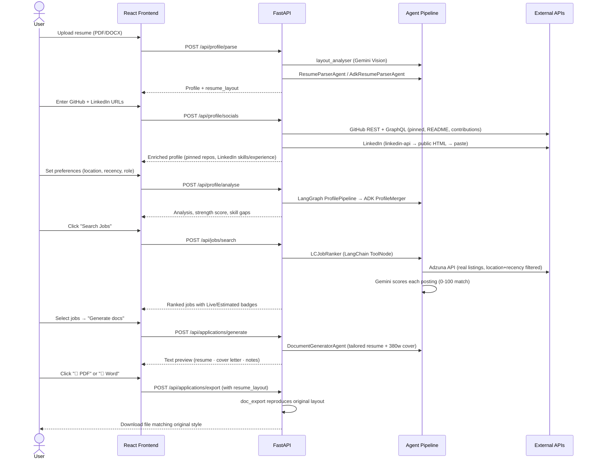

# ✦ AI Career Copilot

A fully-featured multi-agent AI career assistant — FastAPI + React + **Gemini 2.5 Flash** with automatic **Groq Fallback** and a built-in **MCP Server**.

Uploads your resume, reads your GitHub (deep: pinned repos, README, contributions) and LinkedIn profile, searches for **real, recent jobs** matching your preferences, then generates tailored resumes and cover letters that **reproduce your original document's visual style** as downloadable PDF and Word files.

---

## Capstone Submission

Built for the **AI Agents Intensive — Vibe Coding Capstone Project**.

- 🎥 **Demo video:** _add your YouTube link here_
- ✍️ **Kaggle writeup:** kaggle.com/competitions/vibecoding-agents-capstone-project/writeups/new-writeup-1783344655560
- 🌐 **Live demo:** _add your deployed Cloud Run / Render URL here_
- 💻 **Source:** https://github.com/ajaykesarwani/ai-career-copilot

---

## Architecture

```mermaid
flowchart TD
    subgraph UI["Frontend (React + Vite)"]
        U1[📄 Resume upload\nPDF · DOCX · TXT]
        U2[🔗 LinkedIn URL\n+ paste text]
        U3[🐙 GitHub URL]
        U4[📍 Location preferences\nstrict · worldwide · recency]
        U5[📋 Application queue\nPDF · DOCX download]
        U6[🤖 AI Coach\n4 modes · streaming]
    end

    subgraph API["FastAPI Backend"]
        R1[POST /api/profile/parse]
        R2[POST /api/profile/socials]
        R3[POST /api/profile/analyse]
        R4[POST /api/jobs/search]
        R5[POST /api/applications/generate]
        R6[POST /api/applications/export]
        R7[POST /api/coach/chat\nGET  /api/coach/stream]
        R8[GET /api/ops/traces\nGET /api/ops/graph/*]
    end

    subgraph PIPELINE["LangGraph Pipeline Orchestrator"]
        direction LR
        LG1([parse_resume]) --> LG2([enrich_github])
        LG2 --> LG3([merge_profile])
        LG3 --> END1([END])
    end

    subgraph AGENTS["Agent Layer"]
        direction TB
        A1["🔵 ADK LlmAgent\nAdkResumeParserAgent\n(InMemoryRunner + sessions)"]
        A2["🔵 ADK LlmAgent\nAdkProfileMergerAgent\n(+ google_search tool)"]
        A3["🐙 GitHubAgent\nREST + GraphQL\n(repos · pinned · README · contributions)"]
        A4["🔗 LinkedInAgent\n3-tier: API → HTML → paste\n(linkedin-api)"]
        A5["🟢 LangChain ToolNode\nLCJobRanker\n(@tool: Adzuna + estimate)"]
        A6["🔵 ADK LlmAgent\nAdkJobSearchAgent\n(AgentTool + ToolContext)"]
        A7["📝 DocumentGeneratorAgent\nGemini 2.5 Flash\n(resume · cover · notes)"]
        A8["💬 LangGraph Coach Graph\nChatGoogleGenerativeAI\n(+ get_interview_tips tool)"]
        A9["🔵 ADK EvalAgent\n(BuiltInCodeExecutor)"]
    end

    subgraph UTILS["Utilities & Tools"]
        direction TB
        T1["📄 resume_parser.py\nPyPDF2 → Gemini Vision OCR\n(scanned PDF fallback)"]
        T2["🎨 layout_analyser.py\nGemini Vision detects:\ncolumns · accent · header style"]
        T3["🌐 job_search_tool.py\nAdzuna API\n(real · recent · location-filtered)"]
        T4["📐 doc_export.py\nLayout-aware rendering\nReportLab PDF + python-docx DOCX"]
        T5["🛡️ guardrails.py\nPrompt-injection screening\n(input + output)"]
        T6["📊 observability.py\n@traced decorator\nring buffer + stats"]
        T7["🧪 eval_harness.py\nRubric scoring:\ncover-letter · resume · jobs"]
    end

    subgraph EXT["External APIs"]
        E1["🤖 Gemini 2.5 Flash (+ Groq fallback)\ngoogle-generativeai\ngoogle-adk · google-genai\nmodel configurable via GEMINI_MODEL"]
        E2["🐙 GitHub REST API\n+ GraphQL (pinned repos)"]
        E3["🔗 LinkedIn\nlinkedin-api (unofficial)\n+ public HTML scrape"]
        E4["💼 Adzuna Jobs API\nFree: 250 calls/month\n20+ country endpoints"]
    end

    U1 --> R1
    U2 --> R2
    U3 --> R2
    U4 --> R4
    U5 --> R5
    U5 --> R6
    U6 --> R7

    R1 --> T1
    R1 --> T2
    R1 --> A1
    R2 --> A3
    R2 --> A4
    R3 --> PIPELINE
    PIPELINE --> A1
    PIPELINE --> A3
    PIPELINE --> A2
    R3 --> A2
    R4 --> A5
    R4 --> A6
    R5 --> A7
    R6 --> T4
    R7 --> A8
    R8 --> A9

    A1 --> E1
    A2 --> E1
    A3 --> E2
    A4 --> E3
    A5 --> T3
    A5 --> E1
    A6 --> T3
    A6 --> E1
    A7 --> E1
    A8 --> E1
    A9 --> E1
    T1 --> E1
    T2 --> E1
    T3 --> E4

    T5 -.->|screens| R1
    T5 -.->|screens| R2
    T5 -.->|screens| R7
    T6 -.->|traces| A1
    T6 -.->|traces| A2
    T6 -.->|traces| A3
    T6 -.->|traces| A4
    T6 -.->|traces| A5
    T6 -.->|traces| A7
    T7 -.->|evaluates| R8
```



---

## Agent Framework Map

| Agent | Framework | Key capability |
|---|---|---|
| **AdkResumeParserAgent** | `google.adk` `LlmAgent` + `InMemoryRunner` | Session-isolated resume parsing |
| **AdkProfileMergerAgent** | `google.adk` `LlmAgent` + `google_search` tool | Market-aware career analysis |
| **AdkJobSearchAgent** | `google.adk` `LlmAgent` + `AgentTool` + `ToolContext` | Adzuna as formal ADK tool |
| **AdkEvalAgent** | `google.adk` + `BuiltInCodeExecutor` | Runs Python to check output quality |
| **LCJobRanker** | `langgraph` `StateGraph` + `langchain` `@tool` + `ToolNode` | `AIMessage`/`ToolMessage` tool loop |
| **LangGraph Coach** | `langgraph` + `ChatGoogleGenerativeAI` + `ToolNode` | Stateful conversation with `add_messages` |
| **Profile Pipeline** | `langgraph` `StateGraph` (`TypedDict` + `Annotated`) | Typed parse→enrich→merge graph |
| **GitHubAgent** | `google.adk` base + GitHub REST + GraphQL | Pinned repos, README, contributions |
| **LinkedInAgent** | `linkedin-api` + HTML scrape + Gemini | 3-tier enrichment, always has a fallback |
| **DocumentGeneratorAgent** | `google-generativeai` direct | 380+ word cover letters, placeholder rules |

---

## Feature Status

| Feature | Status |
|---|---|
| Resume upload (PDF · DOCX · TXT · scanned) | ✅ Full — OCR fallback via Gemini Vision |
| Resume layout detection (columns · colour · header) | ✅ Gemini Vision analyses visual design on upload |
| Generated docs reproduce original layout | ✅ PDF + DOCX honour detected accent colour, columns, header style |
| PDF download | ✅ ReportLab, layout-aware |
| Word (.docx) download | ✅ python-docx, layout-aware |
| Contact placeholders when data missing | ✅ `[Your Phone Number]` etc. — never invented |
| GitHub enrichment | ✅ Deep: repos + languages + **pinned** + **README** + **contributions** |
| LinkedIn auto-read by URL | ✅ 3-tier: linkedin-api → public HTML → paste fallback |
| Real, recent job listings | ✅ Adzuna API (needs free keys) — live, dated, location-filtered |
| Strict location mode | ✅ Drops postings not matching requested location |
| Recency control | ✅ 3 days → 1 month selector |
| Live vs estimated job badge | ✅ ✓ Live (Adzuna) or ~ Estimated clearly labelled |
| Full-length cover letter (380+ words) | ✅ Prompt-enforced + auto-expansion retry |
| Agent guardrails | ✅ Prompt-injection screening on every untrusted input |
| Agent observability | ✅ `@traced` on all agents → `/api/ops/traces` |
| Agent evaluation | ✅ Rubric + ADK BuiltInCodeExecutor → `/api/ops/eval/*` |
| LangGraph pipeline | ✅ Typed `StateGraph` — `ProfilePipelineState`, `JobSearchState`, `CoachState` |
| Graph topology inspection | ✅ Mermaid via `/api/ops/graph/{profile\|jobs\|coach}` |
| MCP server | ✅ `mcp_server.py` exposes parse/search/coach as MCP tools over stdio |
| Automatic Gemini→Groq fallback | ✅ Triggers on Gemini 429 (quota) or missing key |

---

## Quick Start

### Prerequisites
- Python 3.11+, Node.js 22+ (Active/Maintenance LTS — Node 18 and 20 have both reached end-of-life)
- A **Gemini API key** (free): https://aistudio.google.com/app/apikey

```bash
git clone https://github.com/ajaykesarwani/ai-career-copilot.git
cd ai-career-copilot
cp .env.example .env
# Edit .env — add GEMINI_API_KEY (required) + optional keys below
```

### Optional keys (all free)

| Variable | Where to get | What it unlocks |
|---|---|---|
| `GROQ_API_KEY` | https://console.groq.com/keys | Automatic fallback when Gemini returns a 429 (quota exceeded) |
| `ADZUNA_APP_ID` + `ADZUNA_APP_KEY` | https://developer.adzuna.com/ | Real, live job listings (250 calls/month free) |
| `GITHUB_TOKEN` | https://github.com/settings/tokens | 60 → 5,000 req/hr; **pinned repos** (requires auth) |
| `LINKEDIN_EMAIL` + `LINKEDIN_PASSWORD` | Your LinkedIn account | Full profile scrape via linkedin-api |

Both `GEMINI_MODEL` and `GROQ_MODEL` are also configurable in `.env` — both providers retire model IDs periodically, so check `.env.example` for the current defaults and links to each provider's deprecation page if a call starts failing.

### Run with Docker (easiest)

```bash
docker-compose up --build
# Frontend: http://localhost:5173
# API docs: http://localhost:8000/docs
# Agent traces: http://localhost:8000/api/ops/traces
# Pipeline graphs: http://localhost:8000/api/ops/graph/profile
```

### Run without Docker

```bash
# Backend
cd backend
pip install -r requirements.txt
uvicorn main:app --reload --port 8000

# Frontend (separate terminal)
cd frontend
npm install && npm run dev
```

### Run the MCP server (optional)

`backend/mcp_server.py` exposes resume parsing, job search, and the career
coach as MCP tools over stdio, so any MCP-compatible client (e.g. Claude
Desktop) can call into this app directly:

```bash
cd backend
python mcp_server.py
```

Then point your MCP client's config at that command, e.g. for Claude Desktop's
`claude_desktop_config.json`:

```json
{
  "mcpServers": {
    "ai-career-copilot": {
      "command": "python",
      "args": ["/absolute/path/to/backend/mcp_server.py"]
    }
  }
}
```

---

## User Flow



---

## Project Structure

```
ai-career-copilot/
├── backend/
│   ├── main.py                      FastAPI app + CORS + router mounting
│   ├── mcp_server.py                Exposes parse/search/coach as MCP tools over stdio
│   ├── requirements.txt             All Python deps (incl. google-adk, langgraph)
│   ├── agents/
│   │   ├── base.py                  Shared Gemini async wrapper
│   │   ├── resume_parser.py         Agent 1: text extraction + contact parsing
│   │   ├── github_agent.py          Agent 2: REST + GraphQL + README + contributions
│   │   ├── linkedin_agent.py        Agent 3: 3-tier LinkedIn enrichment
│   │   ├── merger_agent.py          Agent 4: multi-source merge + strength score
│   │   ├── job_ranker.py            Agent 5: Adzuna tool + Gemini ranking
│   │   ├── doc_generator.py         Agent 6: tailored resume/cover/notes
│   │   ├── coach_agent.py           Agent 7: interview coach (streaming)
│   │   ├── adk_agents.py            ADK: LlmAgent, InMemoryRunner, BuiltInCodeExecutor
│   │   ├── pipeline_graph.py        LangGraph: ProfilePipeline, JobPipeline, CoachGraph
│   │   └── lc_job_ranker.py         LangChain: @tool, ToolNode, AIMessage, ToolMessage
│   ├── routers/
│   │   ├── profile.py               /api/profile — parse + socials + analyse
│   │   ├── jobs.py                  /api/jobs — 3-tier search
│   │   ├── applications.py          /api/applications — generate + layout-aware export
│   │   ├── coach.py                 /api/coach — LangGraph primary + streaming fallback
│   │   └── ops.py                   /api/ops — traces, stats, graphs, eval
│   ├── models/
│   │   └── schemas.py               Pydantic: CandidateProfile, ResumeLayout, Job, …
│   └── utils/
│       ├── resume_parser.py         PyPDF2 + Gemini Vision OCR fallback
│       ├── layout_analyser.py       Gemini Vision → ResumeLayout detection
│       ├── doc_export.py            Layout-aware PDF (ReportLab) + DOCX (python-docx)
│       ├── job_search_tool.py       Adzuna API — country routing, recency, location
│       ├── guardrails.py            Prompt-injection screening (input + output)
│       ├── observability.py         @traced + ring buffer + stats
│       └── eval_harness.py          Rubric scoring for cover letters, resumes, jobs
├── frontend/
│   └── src/
│       ├── pages/
│       │   ├── ProfilePage.jsx      4-step onboarding with OCR + layout badges
│       │   ├── JobsPage.jsx         Live/Estimated badges, location/recency header
│       │   ├── ApplicationsPage.jsx Queue + PDF/DOCX download buttons
│       │   └── CoachPage.jsx        Streaming coach, 4 modes, quick prompts
│       ├── components/
│       │   ├── Sidebar.jsx          Pinned repos, LinkedIn status, layout badge
│       │   ├── Pipeline.jsx         5-step agent progress visualiser
│       │   └── UI.jsx               Shared primitives (Card, Btn, Tabs, AgentMsg…)
│       └── hooks/
│           ├── useStore.jsx          Global state (layout, pinned repos, li_structured)
│           └── useApi.js             API client (exportDoc passes resume_layout)
├── deployment/
│   ├── deploy.sh                    Cloud Run one-command deploy
│   ├── render.yaml                  Render.com blueprint
│   └── README.md                    Detailed deploy guide
├── Dockerfile
├── docker-compose.yml
├── .dockerignore                    Keeps node_modules/.git/.env out of build contexts
└── .env.example                     All env vars documented
```

---

## Deploy

### Google Cloud Run
```bash
export GCP_PROJECT_ID=your-project
export GEMINI_API_KEY=AIza-...
export ADZUNA_APP_ID=...  ADZUNA_APP_KEY=...
chmod +x deployment/deploy.sh && ./deployment/deploy.sh
```

### Render.com
Push to GitHub → New Blueprint → point to repo → add env vars → Deploy.
Free tier available; both services deploy in ~3 minutes.